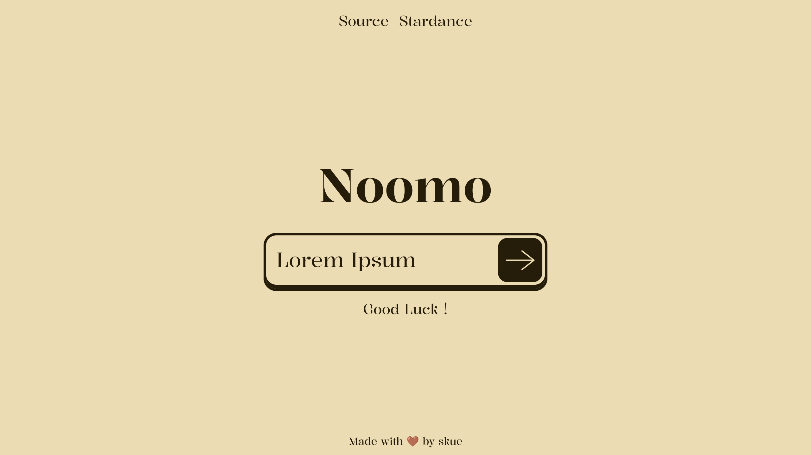

# Noomo
A game where you need to guess words that an LLM generates




### **[Website](http://noomo.dino.icu/)**

## How to play ?

1. Open the site : [http://noomo.dino.icu/](http://noomo.dino.icu/)
2. Enter a sentence, click on the button
3. Enjoy !

To submit a word, just type it and click enter

---

## Features

- Let you input any sentence and play
- Generate a lot of words, then sort them to have better results
- Let you have clues if you cant find words
- Shows stats : the number of tries and clues used

---

## Running locally

### **The website**

You need pnpm and node installed

1. Clone the repo
```
git clone https://github.com/skueee/noomo.git
cd noomo
```
2. Go to the frontend directory
```
cd frontend/noomo-frontend
```
3. Download the dependencies
```
pnpm install
```
4. Launch the server
```
pnpm run dev
```

### The backend

#### **With Docker**

1. Download the container
```
docker pull ghcr.io/skueee/noomo:latest
```
2. Execute it
```
docker run -d -p 8001:8001 -v noomo:/noomo -e DB_PATH=/noomo/data ghcr.io/skueee/noomo:latest
```
DB_PATH is the place where Python will try to access the sql database. For that, the recommended approach is to use volumes. Change it if you wich to

8001 is the default port.

#### **With UV**

1. Install UV : [Installation Guide](https://docs.astral.sh/uv/getting-started/installation/)
2. Clone the repo
```
git clone https://github.com/skueee/noomo.git
```

3. Go to the noomo directory
```
cd noomo
```

4. Sync dependencies
```
uv sync
```

5. Enter the venv
```
source .venv/bin/activate
```

6. Download the model
```
uv run download
```

7. Launch the server
```
uvs server
```
or
```
uvs dev
```

---

## How does this work ?

The website runs with NextJS. At the start of each games, it sends a request to the backend. 
Everything on the website is rendered client side, and things are passed from page to page using sessionStorage because it was too complex to use search params for this kind of data.

The backend is a Python FastAPI server hosted by Hackclub Nest. It uses Transformers to run a local model (Qwen 2.5 0.5B). Everything runs on less than 2gb of RAM.
The model is packed into the Dockerimage to have shorter start time.

---

## AI Usage ?

A bit of AI was used when I couldn't understand something (because of my English level, or my technical skills), for research (finding tools, libraries, when a simple google research is not enough), or to help me with some "advanced" things I didn't knew about (for example, some git commands that I didn't knew how to use or errors solving in the ML part).

I never straight up pasted code from AI. I used AI as a tool to learn, then I wrote myself my own code based on that or read the source provided if any and I needed more infos. 

---

## Credits

### Backend
**Model used :** [Qwen2.5-0.5B](https://huggingface.co/Qwen/Qwen2.5-0.5B)

**Transformers, for all the ML part :** https://huggingface.co/docs/transformers/index

**FastAPI, the library used for the API :** https://fastapi.tiangolo.com/

**UV, the package manager used for the backend :** https://docs.astral.sh/uv/

**uv-script, for the script management :** https://pypi.org/project/uv-script/

**Server provided by [Hackclub Nest](https://hackclub.app/), thanks !**

### Frontend

**NextJS :** [https://nextjs.org/](https://nextjs.org/)

**TailwindCSS :** [https://tailwindcss.com/](https://tailwindcss.com/)

**PNPM :** [https://pnpm.io/fr/](https://pnpm.io/fr/)

**Vercel :** [https://vercel.com/](https://vercel.com/)

**Domain name provided by [Hackclub DNS](https://dns.hackclub.com/), thank you !**
